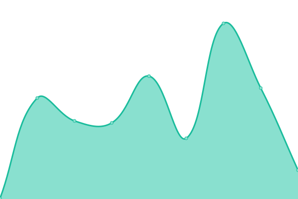
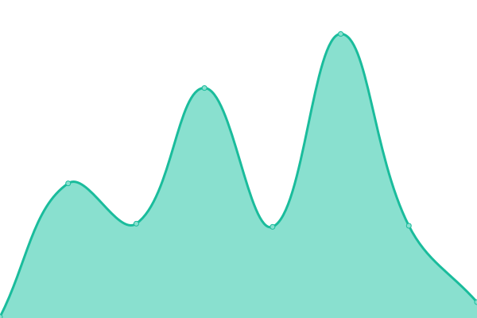
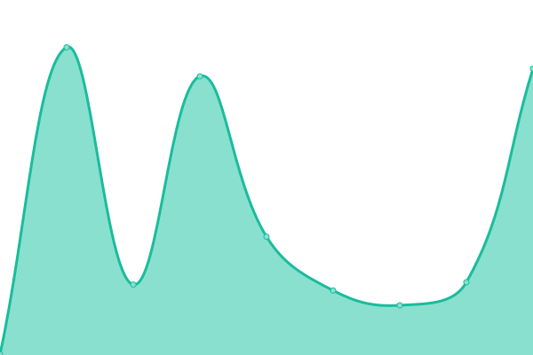

# [📈 Live Status](https://kishikawakatsumi.github.io/xcresulttool-status): <!--live status--> **🟩 All systems operational**

This repository contains the open-source uptime monitor and status page for [Kishikawa Katsumi](https://kishikawakatsumi.com), powered by [Upptime](https://github.com/upptime/upptime).

With [Upptime](https://upptime.js.org), you can get your own unlimited and free uptime monitor and status page, powered entirely by a GitHub repository. We use [Issues](https://github.com/kishikawakatsumi/xcresulttool-status/issues) as incident reports, [Actions](https://github.com/kishikawakatsumi/xcresulttool-status/actions) as uptime monitors, and [Pages](https://kishikawakatsumi.github.io/xcresulttool-status) for the status page.

<!--start: status pages-->
<!-- This summary is generated by Upptime (https://github.com/upptime/upptime) -->
<!-- Do not edit this manually, your changes will be overwritten -->
<!-- prettier-ignore -->
| URL | Status | History | Response Time | Uptime |
| --- | ------ | ------- | ------------- | ------ |
|  [xcresulttool-file.herokuapp.com](https://xcresulttool-file.herokuapp.com/) | 🟩 Up | [xcresulttool-file-herokuapp-com.yml](https://github.com/kishikawakatsumi/xcresulttool-status/commits/HEAD/history/xcresulttool-file-herokuapp-com.yml) | 

 267ms
     
 | 

<a href="https://kishikawakatsumi.github.io/xcresulttool-status/history/xcresulttool-file-herokuapp-com">100.00%</a>
    

|  [xcresulttool-file.herokuapp.com/file](https://xcresulttool-file.herokuapp.com/file) | 🟩 Up | [xcresulttool-file-herokuapp-com-file.yml](https://github.com/kishikawakatsumi/xcresulttool-status/commits/HEAD/history/xcresulttool-file-herokuapp-com-file.yml) | 

 216ms
     
 | 

<a href="https://kishikawakatsumi.github.io/xcresulttool-status/history/xcresulttool-file-herokuapp-com-file">100.00%</a>
    

|  [xcresulttool-static.netlify.app/](https://xcresulttool-static.netlify.app/images/passed.png) | 🟩 Up | [xcresulttool-static-netlify-app.yml](https://github.com/kishikawakatsumi/xcresulttool-status/commits/HEAD/history/xcresulttool-static-netlify-app.yml) | 

 312ms
     
 | 

<a href="https://kishikawakatsumi.github.io/xcresulttool-status/history/xcresulttool-static-netlify-app">100.00%</a>
    

|  [make-check.vercel.app](https://make-check.vercel.app/) | 🟩 Up | [make-check-vercel-app.yml](https://github.com/kishikawakatsumi/xcresulttool-status/commits/HEAD/history/make-check-vercel-app.yml) | 

 508ms
     
 | 

<a href="https://kishikawakatsumi.github.io/xcresulttool-status/history/make-check-vercel-app">100.00%</a>
    

<!--end: status pages-->

[**Visit our status website →**](https://kishikawakatsumi.github.io/xcresulttool-status)

## 📄 License

- Powered by: [Upptime](https://github.com/upptime/upptime)
- Code: [MIT](./LICENSE) © [Kishikawa Katsumi](https://kishikawakatsumi.com)
- Data in the `./history` directory: [Open Database License](https://opendatacommons.org/licenses/odbl/1-0/)
